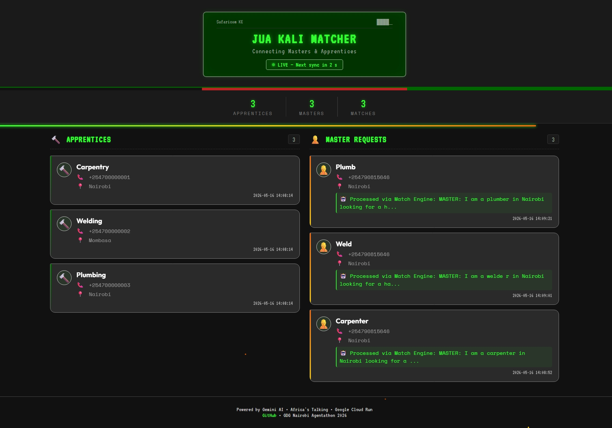

# The Jua Kali Apprenticeship Matcher 🔨🔥

**GDG Nairobi Agentathon 2026 — Challenge 03**
*Build AI Agents. Solve Kenya's Real Problems.*

---

## 1. The Problem

Kenya's jua kali sector employs over **15 million people**, yet it remains almost entirely informal. Skills and opportunities are shared orally, creating a massive "connection gap": masters with decades of experience can't find apprentices, and eager youth can't find mentors.

These users primarily use **feature phones**. They will never download an app. They need a solution that works over **voice, SMS, and USSD** — the channels they already use every day.

## 2. Our Solution

A **"No-App" AI-powered matching platform** that brings the power of Gemini to every feature phone in Kenya:

- **Youth** register their trade interest and location via a fast **USSD menu** (`*384*54593#`).
- **Masters** describe their needs naturally via **Voice call** or **SMS**.
- **The Gemini Agent** listens, extracts the trade & location, searches the database, and **autonomously matches and notifies both parties via SMS**.

## 3. Screenshot



## 4. Agent Architecture

Our solution is a genuine **autonomous AI Agent** with tool use, multi-model failover, and a fallback intelligence engine:

```
┌─────────────────────────────────────────────────────┐
│                  INCOMING REQUEST                    │
│         (Voice / SMS / USSD via Africa's Talking)    │
└──────────────────────┬──────────────────────────────┘
                       │
                       ▼
┌──────────────────────────────────────────────────────┐
│              FastAPI Webhook Router                   │
│  /ussd  → Youth Registration (SQLite)                │
│  /sms   → Master Request → triggers Agent            │
│  /voice → Master Voice → triggers Agent              │
└──────────────────────┬──────────────────────────────┘
                       │
                       ▼
┌──────────────────────────────────────────────────────┐
│            🤖 GEMINI AI AGENT                        │
│                                                      │
│  Phase 1: Multi-Model AI (tries 4 Gemini models)     │
│    → Extracts: trade, location, summary              │
│                                                      │
│  Phase 2: Regex Match Engine (failsafe fallback)     │
│    → Pattern-matches known trades & locations        │
│                                                      │
│  Phase 3: Tool Execution                             │
│    → search_apprentices(trade, location)             │
│    → notify_apprentice(phone, match_info)   [SMS]    │
│    → notify_master(phone, result_summary)   [SMS]    │
│    → save_master(record to dashboard DB)             │
└──────────────────────┬──────────────────────────────┘
                       │
                       ▼
┌──────────────────────────────────────────────────────┐
│          📊 LIVE DASHBOARD (/dashboard)              │
│   Auto-refreshing, feature-phone inspired UI         │
│   Shows registered youth, master requests,           │
│   AI summaries, and match counts in real-time        │
└──────────────────────────────────────────────────────┘
```

**Tech Stack:** Google Gemini API · FastAPI · Africa's Talking (SMS/USSD/Voice) · SQLite · Google Cloud Run

## 5. How to Run Locally

```bash
# 1. Clone the repo
git clone https://github.com/perfectmalcolm/Apprenticeship-Matcher.git
cd Apprenticeship-Matcher

# 2. Create a virtual environment
python -m venv venv
source venv/bin/activate        # Linux/Mac
# venv\Scripts\activate         # Windows

# 3. Install dependencies
pip install -r requirements.txt

# 4. Set environment variables
export GEMINI_API_KEY=your_gemini_key
export AT_USERNAME=sandbox
export AT_API_KEY=your_africastalking_key

# 5. Run the server
uvicorn main:app --reload --port 8080

# 6. Open the dashboard
# http://localhost:8080/dashboard
```

## 6. How to Interact (Live Demo)

**Live Dashboard:** [https://jua-kali-matcher-775881152318.us-central1.run.app/dashboard](https://jua-kali-matcher-775881152318.us-central1.run.app/dashboard)

### Step 1 — Register a Youth (USSD)
- Open the [Africa's Talking Simulator](https://simulator.africastalking.com/).
- Dial `*384*54593#`.
- Enter a trade (e.g., `Carpentry`) and a location (e.g., `Nairobi`).

### Step 2 — Trigger a Master Request (SMS)
- Send an SMS to shortcode `24881` starting with the keyword **`MASTER:`**
- *Example:* `MASTER: I am a carpenter in Nairobi looking for a hardworking apprentice.`

### Step 3 — Watch the Dashboard
- The **Live Dashboard** auto-refreshes every 15 seconds.
- The Master's request appears with an **AI-generated summary**.
- Matching apprentices are notified via SMS automatically.

## 7. Team Members
| Name | Role |
|------|------|
| **Malcolm Kioko** | Lead AI Agent & Backend Engineer |
| **Macklee Gitonga** | Frontend & Cloud Deployment |
| **Abigail Wairi** | Research & Documentation |
| **Lucy Karimi** | Testing & Quality Assurance |

## 8. Project Submission
- **GitHub:** [https://github.com/perfectmalcolm/Apprenticeship-Matcher](https://github.com/perfectmalcolm/Apprenticeship-Matcher)
- **Live Demo:** [https://jua-kali-matcher-775881152318.us-central1.run.app/dashboard](https://jua-kali-matcher-775881152318.us-central1.run.app/dashboard)
